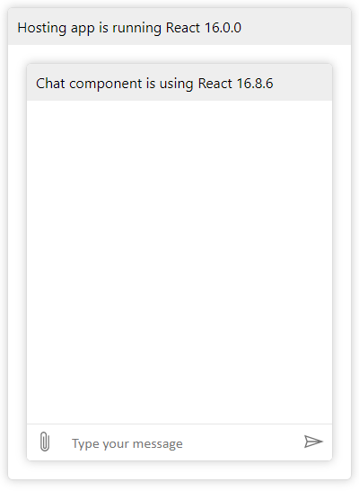

# Using different version of React for hosting app and Web Chat

Starting from Web Chat 4.6, we are migrating to React Hooks and requiring React 16.8.6 or up.

In this sample, we will show how to use Web Chat in an hosting app with React version 16.0.0, instead of the required 16.8.6.

There are several key limitations in this sample. They are outlined in [this section](#why-not-to-use-two-versions-of-react).

# How to run locally



To run this sample, follow steps below:

1. Clone this repository
1. Run `npm install`
1. Run `npm start`
1. Browse to http://localhost:3000/

# How it works

There are two packages in this [monorepo](https://en.wikipedia.org/wiki/Monorepo):

- `app`: the hosting app, created using [`create-react-app`](https://github.com/facebook/create-react-app)
   - Depends on `react@16.0.0` and `react-dom@16.0.0`
- `chat-component`: the chat component, which will render Web Chat
   - Depends on `react@16.8.6` and `react-dom@16.8.6`

The hosting app will create an [isolated DOM element](https://reactjs.org/docs/integrating-with-other-libraries.html) and pass it to the `chat-component` package. The chat component will control the rendering of the DOM element, while the hosting app control the lifetime.

The hosting app will tell the chat component when it is time to remove the DOM element from the tree, and the chat component should stop any further rendering.

## Chat component

In `chat-component` package, we created an entrypoint for rendering a React component to a specific DOM element. Note that we are using `react-dom@16.8.6` when mounting and unmounting the component to the DOM.

```jsx
import { render, unmountComponentAtNode } from 'react-dom';

function renderChatComponent(props, node) {
  render(<ChatComponent {...props} />, node);

  return () => unmountComponentAtNode(node);
}
```

> This entrypoint will return a function, when called, would unmount the component. This function call be [called multiple times to update the props](https://reactjs.org/docs/react-dom.html#render).

## Hosting app

In the hosting application, we created a new component called `<ChatComponentWrapper>` and save the reference.

```jsx
class ChatComponentWrapper extends React.Component {
  constructor(props) {
    super(props);

    this.saveChatComponentRef = ref => this.chatComponentRef = ref;
  }

  render() {
    return (
      <div ref={ this.saveChatComponentRef } />
    );
  }
}
```

When `<ChatComponentWrapper>` is mounted or updated, we will call `chat-component` to do the rendering.

```diff
+ import renderChatComponent from 'chat-component';

  class ChatComponentWrapper extends React.Component {
    constructor(props) {
      super(props);

      this.saveChatComponentRef = ref => this.chatComponentRef = ref;
    }

+   componentDidMount() {
+     this.componentDidMountOrUpdate();
+   }

+   componentDidUpdate() {
+     this.componentDidMountOrUpdate();
+   }

+   componentDidMountOrUpdate() {
+     renderChatComponent(this.props, this.chatComponentRef);
+   }

    render() {
      return (
        <div ref={ this.saveChatComponentRef } />
      );
    }
  }
```

When it is time to unmount, we will call the `chat-component` to unmount the component.

```diff
  import renderChatComponent from 'chat-component';

  class ChatComponentWrapper extends React.Component {
    constructor(props) {
      super(props);

      this.saveChatComponentRef = ref => this.chatComponentRef = ref;
    }

    componentDidMount() {
      this.componentDidMountOrUpdate();
    }

    componentDidUpdate() {
      this.componentDidMountOrUpdate();
    }

    componentDidMountOrUpdate() {
-     renderChatComponent(this.props, this.chatComponentRef);
+     this.unmountChatComponent = renderChatComponent(this.props, this.chatComponentRef);
    }

+   componentWillUnmount() {
+     this.unmountChatComponent();
+   }

    render() {
      return (
        <div ref={ this.saveChatComponentRef } />
      );
    }
  }
```

# Why using two versions of React

Although we recommend you to upgrade your hosting app as soon as you could, we understand your hosting app may need some time to update its React dependencies, especially when your app is huge.

As stated in [this article](https://reactjs.org/warnings/invalid-hook-call-warning.html), React requires all components that use hooks in the same React DOM tree, must use the _same instance_ of React.

In this approach, we isolated the DOM element from the React DOM tree. And use another `react-dom` package to continue the rendering. So the React DOM tree is virtually broken into two parts, although they looks contiguous. This approach is a [supported scenario outlined in React docs](https://reactjs.org/docs/integrating-with-other-libraries.html).

# Why not to use two versions of React

There are several key limitations to this approach:

- Increased memory usage and bundle size
- [React-based customizations](https://github.com/microsoft/botframework-webchat#customize-web-chat-ui) added to Web Chat will still requires React 16.8.6 or up
   - For example, activity and attachment middleware will be required to use the newer React
- Introduce new package and could increase unnecessary fragmentation in your codebase
- The rendering processes between two DOM trees are asynchronous and not guaranteed to complete at the same time

# Further reading

- [Web Chat: Customize Web Chat UI](https://github.com/microsoft/botframework-webchat#customize-web-chat-ui)
- [React: Rules of Hooks](https://reactjs.org/docs/hooks-rules.html)
- [React: Integrating with Other Libraries](https://reactjs.org/docs/integrating-with-other-libraries.html)
- [React: Invalid Hook Call Warning](https://reactjs.org/warnings/invalid-hook-call-warning.html)
